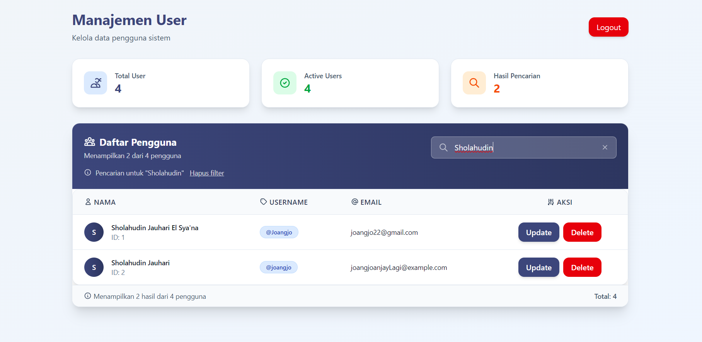
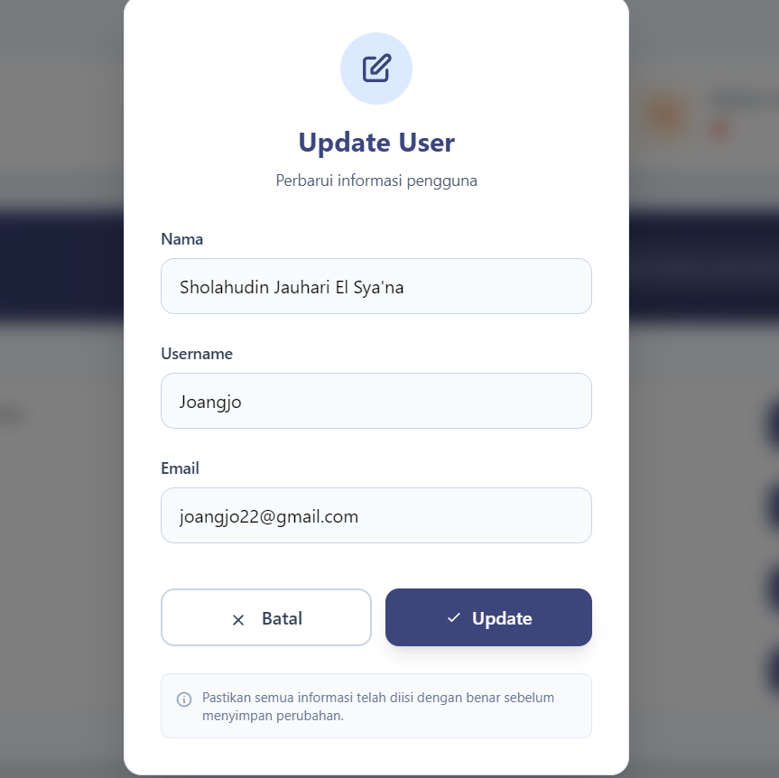

# User Management App (Laravel & Vue.js)

<p align="center">
  
  
  
  
  
</p>

Aplikasi Full-Stack untuk manajemen pengguna yang dibuat sebagai bagian dari tugas seleksi magang. Aplikasi ini mencakup sistem autentikasi pengguna berbasis JWT dan fungsionalitas CRUD (Create, Read, Update, Delete) penuh.

---

## ## Fitur Utama

-   🔐 **Autentikasi JWT**: Registrasi dan Login aman menggunakan JSON Web Tokens.
-   👤 **Manajemen Profil**: Pengguna dapat melihat data profilnya setelah login.
-   📊 **Dashboard Admin**: Menampilkan semua data pengguna dalam format tabel yang interaktif.
-   🔍 **Pencarian Real-time**: Fitur pencarian untuk memfilter data pengguna berdasarkan nama atau username.
-   ✏️ **CRUD Penuh**: Semua pengguna yang login dapat memperbarui dan menghapus data pengguna lain.
-   🐳 **Containerized**: Backend dan database berjalan di dalam container Docker untuk kemudahan setup.

---

---

## 📸 Screenshot Aplikasi

### Halaman Login
<p align="center">
  
</p>

### Halaman Registrasi
<p align="center">
  
</p>

### Halaman Dashboard
<p align="center">
  
</p>

### Search Bar
<p align="center">
  
</p>

### Update User 
<p align="center">
  
</p>

### Delete User 
<p align="center">
  
</p>

---

## ## Teknologi yang Digunakan

#### **Backend (API)**
-   **Framework**: Laravel 12
-   **Database**: PostgreSQL
-   **Autentikasi**: `tymon/jwt-auth`
-   **Environment**: Docker & Docker Compose

#### **Frontend**
-   **Framework**: Vue.js 3 (dengan Vite)
-   **Routing**: Vue Router
-   **State Management**: Pinia
-   **HTTP Client**: Axios
-   **Styling**: Tailwind CSS

---

## ## Instalasi & Setup Lokal

### ### Prasyarat
-   Git
-   Docker & Docker Compose
-   Node.js (v18 atau lebih baru)
-   Composer

### ### 1. Setup Backend (Laravel)

```bash
# 1. Clone repository
git clone [URL_GITHUB_KAMU]
cd [NAMA_FOLDER_PROYEK]/backend

# 2. Salin file environment
cp .env.example .env

# 3. Jalankan container Docker (database PostgreSQL)
docker-compose up -d

# 4. Install dependensi Composer
composer install

# 5. Generate application key
php artisan key:generate

# 6. Generate JWT secret key
php artisan jwt:secret

# 7. Jalankan migrasi database
php artisan migrate

# 8. Jalankan server Laravel (di terminal terpisah)
php artisan serve
# Backend akan berjalan di [http://127.0.0.1:8000](http://127.0.0.1:8000)
```

### ### 2. Setup Frontend (Vue.js)
Buka terminal baru untuk frontend.

```bash
# 1. Masuk ke folder frontend
cd ../frontend

# 2. Install dependensi Node.js
npm install

# 3. Jalankan server development Vite
npm run dev
# Frontend akan berjalan di http://localhost:5173
```

---

## ## 📌 Dokumentasi API

---

### ### Registrasi Pengguna
Membuat akun pengguna baru.

-   **Method:** `POST`
-   **Endpoint:** `/api/auth/register`
-   **Body:**
    ```json
    {
      "nama": "Nama Pengguna Baru",
      "username": "usernamebaru",
      "email": "baru@email.com",
      "password": "password_rahasia"
    }
    ```
-   **Success Response (201 Created):**
    ```json
    {
      "message": "Registrasi Berhasil",
      "user": {
        "id": 1,
        "nama": "Nama Pengguna Baru",
        "username": "usernamebaru",
        "email": "baru@email.com",
        "updated_at": "...",
        "created_at": "..."
      }
    }
    ```
-   **Error Response (422 Unprocessable Entity):**
    ```json
    {
        "message": "Validasi gagal",
        "errors": { "email": ["The email has already been taken."] }
    }
    ```

---

### ### Login Pengguna
Mengautentikasi pengguna dan mendapatkan token JWT.

-   **Method:** `POST`
-   **Endpoint:** `/api/auth/login`
-   **Body:**
    ```json
    {
      "username": "usernamebaru",
      "password": "password_rahasia"
    }
    ```
-   **Success Response (200 OK):**
    ```json
    {
        "message": "Login berhasil",
        "access_token": "eyJ0eXAiOiJKV1Qi...",
        "token_type": "bearer",
        "expires_in": 3600
    }
    ```
-   **Error Response (401 Unauthorized):**
     ```json
    { "message": "Username atau password salah." }
    ```

---

### ### Ambil Semua Pengguna (Dashboard)
Mengambil daftar semua pengguna. Membutuhkan autentikasi (Bearer Token).

-   **Method:** `GET`
-   **Endpoint:** `/api/users`
-   **Query Parameters (Opsional):**
    * `search` (string): Filter pengguna berdasarkan `nama` atau `username`. Contoh: `/api/users?search=andi`
-   **Success Response (200 OK):**
    ```json
    [
        {
            "id": 1,
            "nama": "Andi Budianto",
            "username": "andibudi",
            "email": "andi.budi@example.com",
            "created_at": "...",
            "updated_at": "..."
        }
    ]
    ```
---

### ### Ambil Profil Pengguna (Login)
Mengambil data dari pengguna yang sedang login. Membutuhkan autentikasi (Bearer Token).

-   **Method:** `GET`
-   **Endpoint:** `/api/profile`
-   **Success Response (200 OK):**
    ```json
    {
        "id": 1,
        "nama": "Andi Budianto",
        "username": "andibudi",
        "email": "andi.budi@example.com",
        "created_at": "...",
        "updated_at": "..."
    }
    ```

---

### ### Update Pengguna
Memperbarui data pengguna. Membutuhkan autentikasi (Bearer Token).

-   **Method:** `PUT`
-   **Endpoint:** `/api/users/{id}`
-   **Body (Hanya kirim field yang ingin diubah):**
    ```json
    {
        "nama": "Nama Baru Pengguna",
        "username": "username_baru"
    }
    ```
-   **Success Response (200 OK):**
    ```json
    {
        "message": "Data user berhasil diperbarui",
        "user": {
            "id": 1,
            "nama": "Nama Baru Pengguna",
            "username": "username_baru",
            "email": "email_lama@email.com",
            "created_at": "...",
            "updated_at": "..."
        }
    }
    ```
---

### ### Hapus Pengguna
Menghapus data pengguna. Membutuhkan autentikasi (Bearer Token).

-   **Method:** `DELETE`
-   **Endpoint:** `/api/users/{id}`
-   **Success Response (200 OK):**
    ```json
    { "message": "User berhasil dihapus." }
    ```
---

### ### Logout
Menginvalidasi token pengguna. Membutuhkan autentikasi (Bearer Token).

-   **Method:** `POST`
-   **Endpoint:** `/api/logout`
-   **Success Response (200 OK):**
    ```json
    { "message": "Successfully logged out" }
    ```